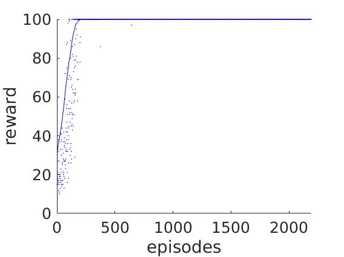

# Reinforcement_learning_cpp_parallel
Name is to be determined.

A parallel reinforcement learning framework written in C++

Goal: build a scalable, reliable and well-maintained RL framework in C++ that can be used for engineering research.

see documentation [here](https://github.com/haotianh9/Reinforcement_learning_cpp_parallel/tree/main/doc/main.pdf)
# alpha 0.1
Version alpha 0.1 implements Policy Proximal Optimization ([PPO](https://arxiv.org/pdf/1707.06347.pdf)) learning algorithm only . Basic MPI functions are used for communications between simulation nodes and the learning node. [Libtorch](https://pytorch.org/cppdocs/) is used for neural network training and inference. Using pybind11 to make our code callable in python and implement other algorithms are our furture goals. 
<!-- We also tried using [Eigen](https://eigen.tuxfamily.org/index.php?title=Main_Page), but finally found that we don't actually need it.  -->

Developed by Kishore Ganesh, Qiongao Liu, Yusheng Jiao, Chenchen Huang, Haotian Hang as USC CSCI596 course final project

We used our code to trian on a cartpole environment. The learning curve using only one environment node is shown as follows.

